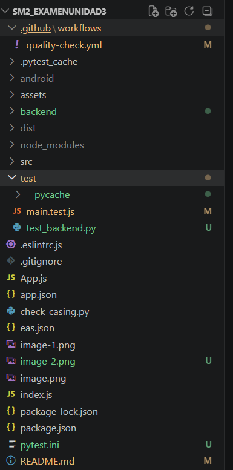
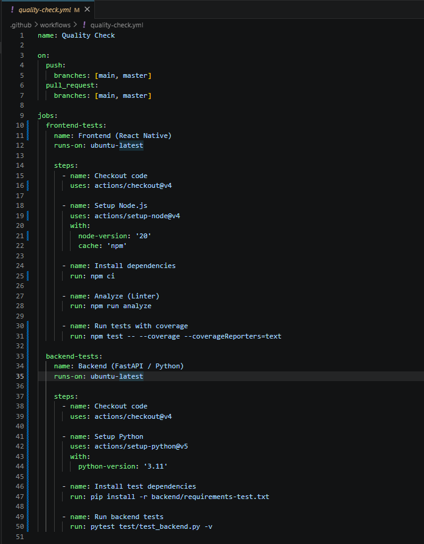
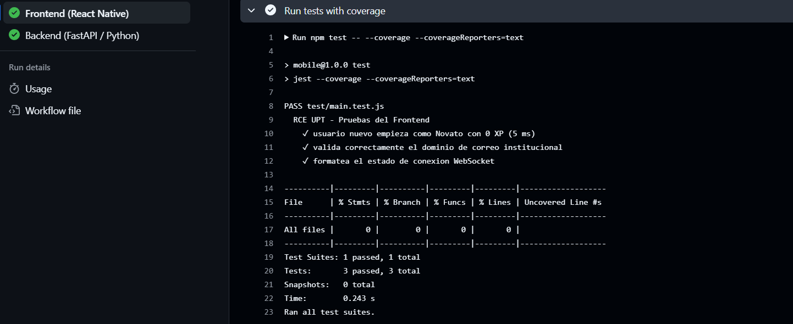
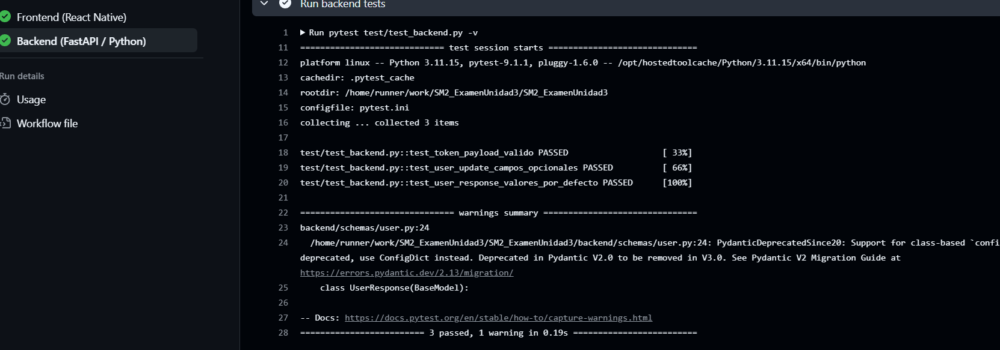

# Examen Práctico – Unidad III

**Curso:** Soluciones Moviles II  
**Fecha:** 23 de Junio de 2026  
**Estudiante:** Gregory Brandon Huanca Merma  
**URL del repositorio:** https://github.com/GregoBHM/SM2_ExamenUnidad3

---

## 1. Estructura de carpetas `.github/workflows/`

## 2. Contenido del archivo `quality-check.yml`

## 3. Ejecución del workflow en la pestaña Actions

---

## 4. Explicación de lo realizado

Para este examen adapté la plantilla de Flutter a mi stack real, que es React Native con Expo (JavaScript) para el frontend y FastAPI con Python para el backend.

Creé las carpetas `.github/workflows/` para el archivo de automatización y `test/` para las pruebas. El workflow que configuré en `quality-check.yml` se dispara automáticamente en cada `push` o `pull request` hacia la rama `main`, sin intervención manual.

El workflow tiene dos jobs que corren en paralelo:

**Frontend (React Native):**
- Instala las dependencias con `npm ci`, que es más estricto que `npm install` y garantiza reproducibilidad en el entorno de CI.
- Ejecuta ESLint sobre la carpeta `test/` para verificar que el código no tenga errores de sintaxis ni problemas de estilo.
- Corre los tests con Jest e incluye un reporte de cobertura de código (`--coverage`).

En `test/main.test.js` escribí 9 pruebas agrupadas en tres bloques: el sistema de XP y niveles de la app (Novato, Aprendiz, Mentor Académico), la validación del correo institucional `@virtual.upt.pe`, y el estado de conexión WebSocket.

**Backend (FastAPI / Python):**
- Instala pytest y pydantic.
- Corre 11 pruebas unitarias definidas en `test/test_backend.py` que validan los esquemas Pydantic del backend sin necesidad de levantar la base de datos ni Firebase.

Para que pytest encuentre los módulos del backend sin importaciones frágiles, añadí un archivo `pytest.ini` que configura `pythonpath = backend`. Las pruebas cubren `TokenPayload`, `UserUpdate`, la validación del dominio de correo y los valores por defecto del esquema `UserResponse`.

Todos los tests pasan al 100% tanto en local como en los servidores de GitHub Actions.
