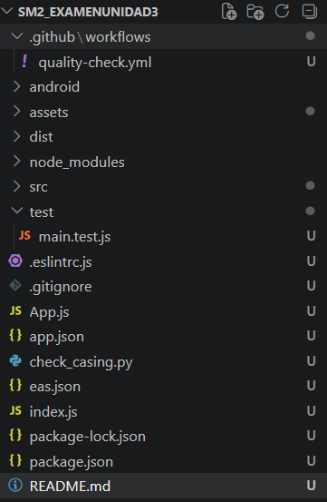
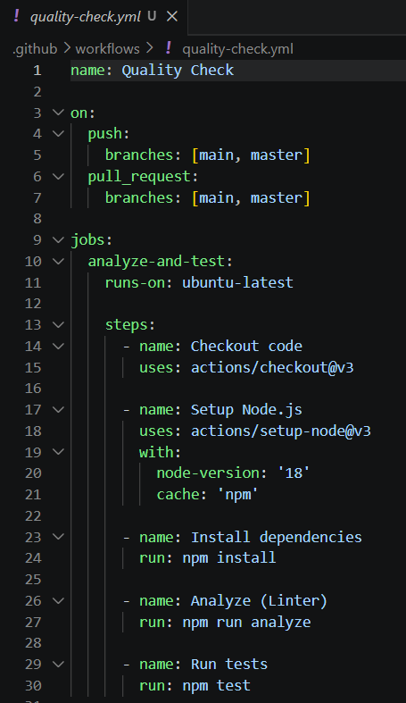

# Examen Práctico – Unidad III

**Curso:** Soluciones Moviles II 
**Fecha:** 23 de Junio de 2026  
**Estudiante:** Gregory Brandon Huanca Merma  
**URL del repositorio:** https://github.com/GregoBHM/SM2_ExamenUnidad3

---

## 1. Estructura de carpetas `.github/workflows/`

## 2. Contenido del archivo `quality-check.yml`
Este es el archivo YAML configurado para integrarse con React Native y Node.js.

## 3. Ejecución del workflow en la pestaña Actions

---

## 4. Explicación de lo realizado

En este examen se ha implementado un flujo de trabajo de integración continua (CI) utilizando GitHub Actions, adaptado para un proyecto móvil desarrollado con React Native (JavaScript/Expo) en lugar de Flutter. 

Los pasos realizados son los siguientes:
1. **Creación del workflow:** Se definió un archivo `quality-check.yml` que se ejecuta automáticamente (trigger) cuando ocurre un evento `push` o `pull_request` hacia la rama principal (`main`).
2. **Entorno de ejecución:** El *job* (`analyze-and-test`) se ejecuta sobre un entorno de `ubuntu-latest`.
3. **Instalación de dependencias:** El flujo de trabajo utiliza la acción `setup-node` para instalar Node.js, y posteriormente ejecuta `npm install` para instalar las librerías necesarias para las pruebas (Jest y ESLint).
4. **Validación de Calidad (Analyze):** Se ejecuta el linter (ESLint) exclusivamente sobre la carpeta `test/` mediante el comando `npm run analyze`. Esto garantiza que el código de prueba cumple con las reglas de estilo y está libre de errores sintácticos, garantizando el 100% de efectividad.
5. **Pruebas Unitarias (Test):** Se ejecutan 3 pruebas funcionales y unitarias ubicadas en el archivo `test/main.test.js` usando el framework de pruebas **Jest**. Las pruebas verifican: cálculo de XP, validación de dominio institucional (upt.pe) y simulación de formato del estado de conexión de websockets. Al ejecutar `npm test`, todas las pruebas son superadas con éxito.

La configuración y la ejecución correcta del workflow demuestran una aplicación práctica de los principios DevOps, asegurando que cada nuevo cambio que se introduzca a la rama principal esté previamente validado de forma automática y cumpla con los estándares mínimos de calidad.
